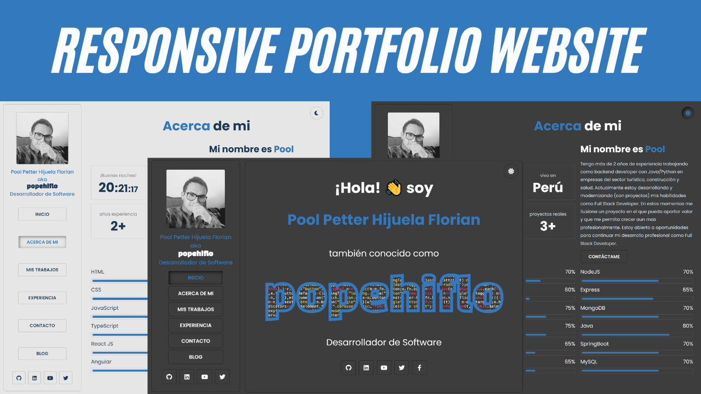

#  Portafolio Personal - Pool Hijuela (popehiflo)


## 🚀 Descripción del Proyecto
🎥 **Video de Implementación:** [YouTube](https://www.youtube.com/watch?v=tjAcXTpIou8)  
🌎 **Visita mi Portafolio:** [GitHub Pages](https://popehiflo.github.io/)  

   

Este proyecto es mi portafolio personal que muestra mis habilidades y proyectos como desarrollador web Fullstack. Está construido con tecnologias modernas para presentar de manera profesional y atractiva mi trabajo y trayectoria profesional.
## 🌟 Características
- **Diseño responsivo:** Adaptado para dispositivos móviles, tablets y desktops.
- **Cambio de tema:** Modo oscuro (predeterminado) y claro con animación (aun no).
- **Secciones dinámicas:** Proyectos y blogs generados desde datos en JavaScript.
- **Modal de blogs:** Vista detallada de artículos/blogs con imágenes y contenido completo.
- **Optimización:** Carga rápida con JavaScript crítico inline y lazy loading de imágenes.

## 🛠️ Tecnologías Utilizadas   
`HTML5`, `CSS3`, `Javascript(ES6+)`, `Responsive Design`, `BEM Notation`
- **Frontend:** HTML5, CSS3, JavaScript (ES6 Modules)
- **Estilos:** BEM Notation, CSS Variables, animaciones personalizadas
- **Despliegue:** GitHub Pages
- **Fuentes/Icons:** Google Fonts (Poppins, Black Han Sans), Font Awesome

## 📂 Estructura del proyecto
```
popehiflo.github.io/
├── public/
│   └── assets/
│       └── imgs/       # Imágenes estáticas
├── src/
│   ├── data/          # Datos de proyectos y blogs (MOCKDATA.js)
│   ├── styles/        # Estilos globales (index.css)
│   ├── utils/         # Lógica JS modular (secciones, tema, etc.)
│   └── index.js       # Punto de entrada JS
├── index.html         # Estructura principal
├── logo.svg           # Logo personal
├── LICENSE            # Licencia MIT
└── README.md          # Este archivo
```


## 🚀 Uso
1. **Explorar localmente:**
   - Clona el repositorio: `git clone https://github.com/popehiflo/popehiflo.github.io.git`
   - Abre `index.html` en un navegador.
2. **Ver en vivo:**
   - Visita [popehiflo.github.io](https://popehiflo.github.io).

## 💻 Desarrollo
- **Requisitos:** Solo un navegador moderno (no se necesitan dependencias adicionales).
- **Modificar contenido:** Edita `src/data/MOCKDATA.js` para añadir proyectos o blogs.
- **Estilos:** Personaliza `src/styles/index.css` según tus necesidades.

## 📄 Licencia
Este proyecto está bajo la [Licencia MIT](LICENSE).

¡Gracias por visitar mi portafolio! Si tienes sugerencias o quieres colaborar, no dudes en contactarme.

         
⌨️ con ❤️ por [popehiflo](https://github.com/popehiflo)
